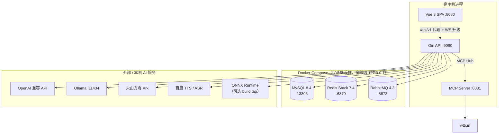
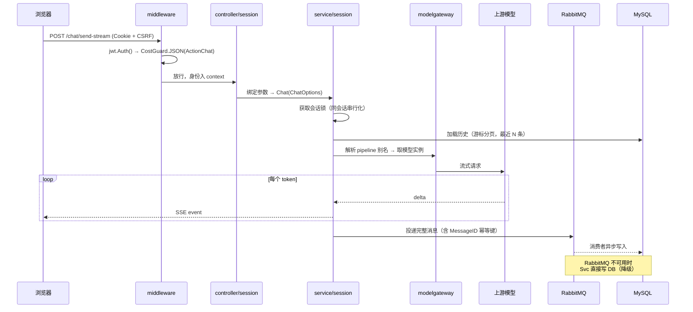
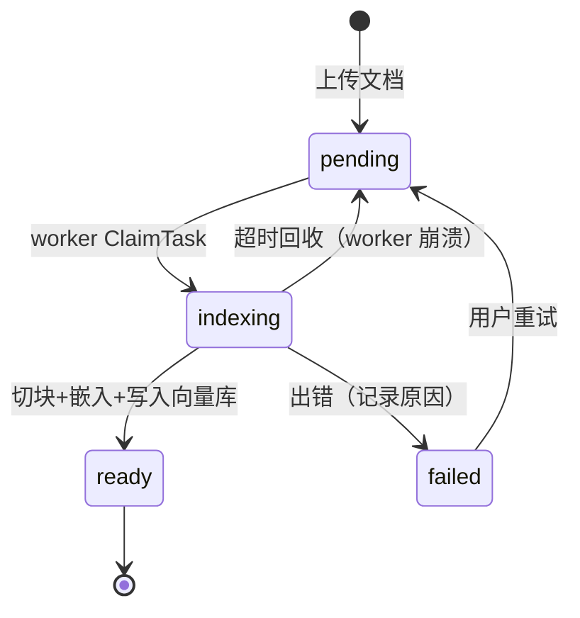
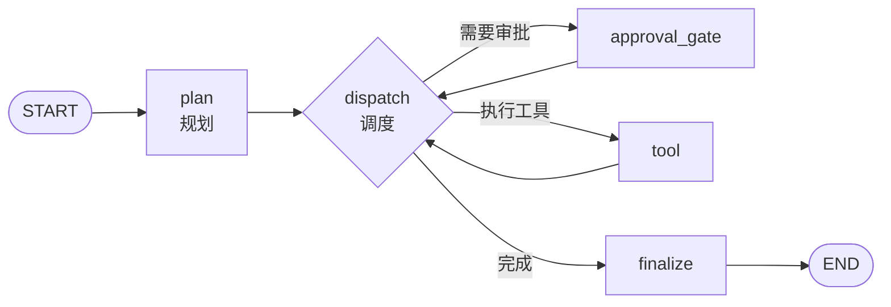

# GopherAI 架构与代码导览

这份文档面向**想读懂或参与这份代码的人**：它解释系统怎么分层、一次请求经过哪些环节、几个核心子系统各自解决什么问题，以及关键设计取舍背后的理由。

与其他文档的分工：

| 文档 | 回答的问题 |
|---|---|
| [`README.md`](README.md) | 这是什么、有什么功能、怎么在本机跑起来、有哪些 API |
| **本文档** | 代码怎么组织、请求怎么流动、为什么这么设计 |
| [`docs/operations.md`](docs/operations.md) | 怎么发布、迁移、备份、恢复 |
| [`docs/realtime-voice.md`](docs/realtime-voice.md) | 实时语音 WebSocket 协议细节 |
| [`training/README.md`](training/README.md) | 怎么微调本地模型 |

---

## 1. 系统全景

GopherAI 不是单体容器部署。**Compose 只负责有状态的基础设施**，Go API、Vue 前端、MCP 服务和所有外部 AI 服务都各自独立运行。这样做的理由是开发期能单独重启后端而不动数据，并且让"哪些东西有持久状态"在拓扑上一目了然。



三个基础设施组件各自承担不可替代的角色：

- **MySQL** —— 唯一的事实来源（source of truth）。用户、会话、消息、知识库、Agent 任务与 checkpoint 全部落这里。
- **Redis Stack** —— 不只是缓存。RAG 的向量索引依赖 RediSearch 的 `FT.*` 命令，所以**必须用 redis-stack 镜像，普通 redis 镜像会导致知识库检索不可用**。此外承载验证码和原子限流。
- **RabbitMQ** —— 聊天消息异步落库。它是**可降级**依赖：不可用时 `rabbitmq.Available()` 返回 false，系统自动回退为直写 MySQL，服务不中断。

---

## 2. 分层架构

代码遵循清晰的单向依赖，上层可以调下层，反之绝不允许：

```
router/        路由注册与中间件装配
    ↓
middleware/    JWT 鉴权 · CostGuard 配额 · 可观测性
    ↓
controller/    HTTP 边界：参数绑定、校验、响应封装
    ↓
service/       业务逻辑与编排（事务边界、状态机、worker）
    ↓
dao/           数据访问，全部经 GORM，普遍带 userName 归属过滤
    ↓
model/         GORM 实体与状态常量

common/        跨层复用的基础设施能力（被 service 与 controller 依赖）
```

### 各层的具体职责

**`router/`** —— 只做装配，不含业务。`router.go` 负责引擎级配置：全局挂 `observability.HTTP` + `Recovery`，`MaxMultipartMemory` 设 8MiB，`SetTrustedProxies(nil)`（不信任任何代理头，避免伪造来源 IP 绕过限流），以及 SPA fallback 到 `vue-frontend/dist`。业务路由按域拆到 `user.go` / `AI.go` / `File.go` / `Image.go` / `MCPHub.go` / `Agent.go`。

**`middleware/`** —— 三个横切关注点：
- `jwt/` —— `jwt.Auth()` 解析令牌并把用户身份注入 context。
- `costguard/` —— **昂贵操作的闸门**。这是本项目一个刻意的设计：不同动作的成本差异极大（一次 Agent 任务可能触发几十次 LLM 调用，一次图像识别独占 ONNX session），所以配额不是统一的 QPS，而是按 `ActionChat` / `ActionVoice` / `ActionRAG` / `ActionMCP` / `ActionAgent` / `ActionImage` **分类计量**，并区分 `JSON()` / `Multipart()` / `NoBody()` 三种请求体形态，另有用户级与全局级并发上限（in-flight）。
- `observability/` —— JSON 访问日志、X-Request-ID、Prometheus 兼容指标。`/metrics` 默认**仅 loopback 可访问**，远程访问需 `Authorization: Bearer $GOPHERAI_METRICS_TOKEN`。

**`common/`** —— 最厚的一层，装的是"与业务无关但项目自己实现"的能力。值得单独一提的子包：

| 子包 | 职责 |
|---|---|
| `aihelper` | 模型实例工厂 + 每会话上下文管理（惰性加载最近 64 条消息，空闲 30 分钟回收，避免内存无界增长） |
| `modelgateway` | 模型目录注册表，Provider / Model / Pipeline 三层解耦（见 §4.1） |
| `mcphub` | MCP 协议、受信 registry、JSON Schema 校验、审批 token、日志脱敏 |
| `rag` | 文档切块、Redis 向量库读写、检索上下文 |
| `health` | 命名检查项 + Required 标记 + 结果缓存，支撑 `/livez` `/readyz` 的语义差异 |
| `code` | 统一业务状态码（1000 成功；2001–2011 参数/用户/限流；3001 禁止；4001 繁忙；5001–5003 模型；6001/6002 语音） |
| `mcp` | **独立 Go module**（`github.com/kaitai/gopherai-mcp`），内置示例天气 MCP 服务 |

> `vue-frontend/go.mod` 是一个**空模块边界**，唯一作用是阻止根级 `go` 命令递归遍历 `node_modules`。它不是一个真实的 Go 模块。

---

## 3. 一次请求的完整生命周期

以最有代表性的**流式聊天** `POST /api/v1/AI/chat/send-stream` 为例：



几个关键点：

**会话锁**。同一会话的请求在 `service/session` 层被串行化。否则并发的两条消息会读到同一份历史，导致上下文错乱、消息顺序不确定。

**MessageID 幂等键**。消息带一个 UUID 唯一索引。RabbitMQ 在网络抖动时可能重投递同一条消息，唯一索引保证重复投递不会产生重复行——这也是迁移 `202607290002` 存在的原因（见 §5）。

**SSE 与降级**。流式输出通过 `controller/session/sse.go` 的 Sink 抽象写出；即使 MQ 挂掉，用户侧的流式体验完全不受影响，只是落库路径变成同步。

---

## 4. 核心子系统

### 4.1 动态模型网关

问题：接入多家 LLM 时，最容易写成一堆 `if provider == "openai"` 散落在业务代码里，加一个模型要改十处。

解法（`common/modelgateway/catalog.go`）：把"模型"这个概念拆成**三层正交的东西**。

```
Provider  ── 怎么连（协议、Base URL、凭据）
             openai-compatible · ollama · ark

Model     ── 连哪个上游模型（模型名、能力）

Pipeline  ── 这个入口做什么（kind 决定编排方式）
             openai(chat) · rag(rag) · mcp(mcp) · ollama(chat) · ark(chat)
```

业务代码只认 Pipeline 名字，不关心底下是谁。新增一个供应商只需注册 Provider + Model，不触碰 controller 和 service。

两个实践细节：
- **兼容旧别名**。`1`/`2`/`3`/`4` 分别映射到 `openai`/`rag`/`mcp`/`ollama`，`doubao` 映射到 `ark`。这是为了让老客户端不因重构而失效。
- **可用性探测但不泄露配置**。`GET /AI/models` 返回每个 pipeline 是否可用（比如 Ark 三项环境变量没配齐就标记不可用），但**不返回 Base URL 和任何凭据**——这个接口是登录用户可见的，不能变成配置泄露面。

### 4.2 Knowledge Base 2.0（RAG）

相比"上传即索引"的朴素做法，这里的核心设计是**把索引变成一个持久化的、可观测的、可恢复的任务**。



为什么不用内存队列：worker 进程重启后，内存队列里的任务会静默消失，用户看到文档永远卡在"处理中"。改成 **MySQL 队列 + `ClaimTask` 租约 + 超时回收**后，崩溃的 worker 持有的任务会在租约过期后被重新领取，状态对用户始终可见。

检索侧支持**跨库检索**，并且引用精确到 `文档 / 标题 / 字符区间`——这样前端可以把引用高亮回原文位置，而不是只给一个文件名。所有 DAO 查询都带 `userName` 过滤，实现用户间的硬隔离。

### 4.3 MCP Hub

MCP 让模型能调用外部工具，这天然是个**安全敏感面**：模型可能被诱导调用危险工具。Hub 的设计基本都在回答"怎么让它可控"。

纵深防御分五层：

1. **受信 registry**（`config/mcp_servers.json`）—— 只有登记过的服务能被发现。默认只放行本机 `weather` 服务。
2. **双层 allowlist** —— `service_allowlist` 控制服务，每个服务内的 `tool_allowlist` 控制工具。
3. **JSON Schema 参数校验** —— 调用前按工具声明的 schema 校验参数，不合法直接拒绝，不透传给下游。
4. **风险分级 + 一次性审批** —— 高风险工具需要先拿 approval challenge，换取一次性 token 才能调用；token 有 TTL（默认 300 秒）且用后作废。
5. **脱敏审计** —— 调用记录写入 `MCPAuditRecord`，但**只存脱敏后的预览与摘要**，不落原始参数与返回值。

另有 `read_only_tools` 标记：只有被标记为只读的工具才允许自动重试（`max_read_only_retries`），因为重试一个非幂等工具可能造成重复副作用。

### 4.4 Eino Agent

这是系统里最复杂的部分。Agent 要能跑长任务、中途要人批准、进程重启后还能接着跑。

**状态图**（`service/agent/graph.go`，基于 Eino Graph）：



`dispatch` 是中心调度节点，`approval_gate` 和 `tool` 执行完都回到它重新判断下一步——这个回边结构让"规划 → 工具 → 总结"可以循环多轮，而不是固定的线性流程。

**任务状态**（`model/agent.go`）共 9 种：
`pending` · `planning` · `running` · `waiting_approval` · `requires_review` · `succeeded` · `failed` · `rejected` · `cancelled`

**步骤状态**同样 9 种，其中最值得注意的是 `execution_unknown`：

> 当一个工具调用发出去了，但结果没能确认（超时、连接中断），步骤会落到 `execution_unknown`。此时系统**绝不自动重放**——因为无法判断副作用是否已经发生。恢复任务时必须由用户显式传 `retry_unknown: true` 才会重试。这是把"不确定性"交还给人来裁决，而不是让系统赌一把。

**崩溃恢复**。任务、步骤和 checkpoint 全部落 MySQL。手动恢复时会**从 MySQL 状态重建 graph**，而不是反序列化一个可能已损坏或版本过旧的 checkpoint blob——这样即使 checkpoint 格式变了，旧任务也不会永久卡死。

**租约防脑裂**。`dao/agent` 的写入普遍带 `WithFencingToken`：worker 领取任务时拿到一个单调递增的令牌，写回时校验。如果一个"假死"的旧 worker 复活并试图写回，它的令牌已经过期，写入被拒绝，不会覆盖新 worker 的进展。

checkpoint 内容**永不通过 API 返回**，避免内部推理状态泄露。

### 4.5 实时语音

`GET /api/v1/AI/voice/realtime` 走 WebSocket，与其他接口有一个刻意的差异：**它不走请求级 CostGuard**。原因是一个语音连接是长连接，按"请求次数"限流没有意义。改由 `service/voiceconversation/hub.go` 施加**连接数上限与音频时长上限**。

`turn.go` 实现单个语音回合：能量 VAD（带迟滞，避免频繁误触发）、PCM16LE → WAV 转换、句子级缓冲以便边说边合成。协议细节见 [`docs/realtime-voice.md`](docs/realtime-voice.md)。

Hub 还实现了 `BeginDrain()`，停机时先停止接受新连接再排空——这是优雅停机的一部分（见 §7）。

---

## 5. 数据模型与迁移

### 迁移框架

项目自研了一套轻量版本化迁移（`migrations/`），**只依赖已有的 GORM 和 MySQL 驱动**，不引入额外迁移二进制。

`registry.go` 定义 `Definition{Version, Name, Revision, Up}`，其 `Checksum()` = SHA-256(Version + Name + Revision)。这个校验和的作用是**检测对已发布迁移的误改**——改了已上线的迁移定义会导致 checksum 不匹配，启动时报错。

铁律：**新增 schema 必须新建更大的 Version，绝不修改已发布的定义。**

| Version | Name | 内容 |
|---|---|---|
| `202607290001` | `legacy_gorm_schema_baseline` | 为旧 AutoMigrate 数据库建立基线 |
| `202607290002` | `messages_message_id_backfill` | 加 `message_id` 列、用 `UUID()` 回填历史空值、再建唯一索引，使 MQ 重投递幂等。**刻意不依赖 Go model**，以便修复 `MessageID` 字段引入之前的旧行 |
| `202607290003` | `sessions_activity_pagination_index` | 建 `idx_sessions_user_activity`，支撑会话 keyset 分页 |

### 启动策略

`GOPHERAI_DB_MIGRATION_MODE` 两种取值：

- **`verify`（默认）** —— 只校验版本与 checksum，**不写任何 DDL**。数据库版本落后则 API 拒绝启动。
- **`compatibility`** —— 允许启动时补 schema，仅供本地临时桥接。**production / staging 环境下直接报错拒绝**（`config/security.go`）。

生产发布顺序因此是：先在发布阶段跑 `go run ./cmd/migrate -command up`，再以 `verify` 模式启动 API。`-command verify` 可作为发布门禁使用，它不写任何 DDL。

---

## 6. 配置体系

三层优先级，后者覆盖前者：

```
1. config/config.toml           可提交的本机开发默认值（无真实凭据）
2. config/config.local.toml     Git 忽略的本机秘密覆盖
3. GOPHERAI_* 环境变量           最高优先级
```

设置 `GOPHERAI_CONFIG_PATH` 时，用一份完整独立的 TOML 替代前两层（**不再叠加 local**），环境变量仍然生效。

两个安全设计：
- **加载失败只报文件路径与变量名，不打印秘密值。**
- `config/security.go` 在 production / staging 环境下**拒绝开发凭据**——比如 JWT key 还是 `dev-only-change-before-production` 就直接启动失败，而不是带着弱密钥静默上线。

配置项清单见 [`.env.example`](.env.example)（含全部 `GOPHERAI_*` 变量）与 `config/config.example.toml`。

---

## 7. 可靠性设计

### 启动与优雅停机

`main.go` 的启动顺序：加载配置 → MySQL → Redis → 注册邮件 worker → RabbitMQ（不可用则降级）→ 知识库索引 worker → Agent worker → readiness checker → HTTP Server。

收到 `SIGINT` / `SIGTERM` 后：

1. `checker.MarkNotReady()` —— `/readyz` 立即转为不健康，让负载均衡摘除本实例
2. `voiceHub.BeginDrain()` —— 停止接受新 WebSocket（长连接不受 `http.Server.Shutdown` 管辖，必须单独处理）
3. `server.Shutdown()` —— 10 秒排空 HTTP
4. 等待各 worker 退出
5. 依次关闭 MCP Hub → Redis → MySQL

整体 15 秒上限。

### 健康检查的语义差异

- **`/livez`** —— 存活探针，**不访问任何外部依赖**。数据库挂了不应该导致容器被反复重启。
- **`/readyz`、`/healthz`** —— 就绪探针。MySQL 与 Redis 标记为 `Required`；RabbitMQ、`agent_worker`、`knowledge_worker`、`registration_email_worker` 为**可降级**，它们不可用不会让实例整体失去流量。

### 降级路径汇总

| 依赖不可用 | 系统行为 |
|---|---|
| RabbitMQ | 消息直写 MySQL，聊天不中断 |
| 注册邮件 SMTP | 账号照常创建，后台 worker 指数退避重试发信 |
| Ark / Ollama / 语音凭据未配置 | 对应 pipeline 在模型目录中标记为不可用，其余功能不受影响 |
| ONNX Runtime 未安装 | 默认构建即不含图像识别（`onnx` build tag 可选） |

---

## 8. 安全边界

| 面 | 措施 |
|---|---|
| 认证 | SPA **不持久化 JWT**，改用 HttpOnly 会话 Cookie（生产附 `Secure` + `SameSite=Strict`），改状态请求带 CSRF header |
| 授权 | DAO 层普遍带 `userName` 过滤，实现用户间硬隔离 |
| 限流 | Redis 原子脚本；限流 key 经 **SHA-256 摘要化**后再存，避免明文标识落进 Redis |
| 成本 | CostGuard 按动作分类配额 + 用户级/全局级并发上限 |
| 代理信任 | `SetTrustedProxies(nil)`，不信任任何转发头 |
| 网络暴露 | Compose 全部端口绑 `127.0.0.1`；生产 compose **不发布 RabbitMQ 管理端口 15672** |
| 生产凭据 | 生产 compose 全部秘密用 `${VAR:?}` **fail-closed**，未设置则拒绝启动 |
| 上传校验 | 图像仅接受真实 JPEG/PNG/GIF，≤10MiB、≤2500 万像素、单边 ≤10000px |
| 审计 | MCP 审计只存脱敏预览；Agent checkpoint 永不经 API 返回 |
| 可观测性 | `/metrics` 默认仅 loopback，远程需 Bearer token |

---

## 9. 代码导览：想改 X，去看 Y

| 你想做的事 | 入手位置 |
|---|---|
| 加一个新的 LLM 供应商 | `common/modelgateway/catalog.go`（注册）+ `common/aihelper/factory.go`（构造） |
| 改聊天的编排逻辑 | `service/session/session.go` |
| 改 SSE 输出格式 | `controller/session/sse.go` |
| 调整 Agent 的规划或工具执行 | `service/agent/graph.go`（节点装配）、`plan.go`（计划解析） |
| 加/改 Agent 状态 | `model/agent.go`（常量）→ `dao/agent/agent.go`（持久化） |
| 接入新的 MCP 工具 | `config/mcp_servers.json`（registry + allowlist） |
| 改 RAG 切块或检索 | `common/rag/chunk.go`、`common/rag/rag.go` |
| 改索引 worker 行为 | `service/knowledgebase/worker.go` |
| 加新 API 路由 | `router/` 下对应域的文件 |
| 调整限流/配额 | `middleware/costguard/guard.go` + `GOPHERAI_COST_GUARD_*` 环境变量 |
| 加数据库表或列 | `migrations/registry.go` 新增更大 Version（**不要改已有定义**） |
| 改前端页面 | `vue-frontend/src/views/` |
| 改前端 API 调用 | `vue-frontend/src/utils/api.js`、`agentApi.js` |

**关键文件速查**：

- `main.go` —— 启动、优雅停机、readiness 装配
- `router/router.go` —— 路由分组与中间件装配全貌
- `common/modelgateway/catalog.go` —— 默认 Provider/Model/Pipeline 注册
- `config/config.go` —— 全部配置结构体
- `migrations/registry.go` —— 迁移版本清单

---

## 10. 前端架构

Vue 3 + Vue Router 4 + Element Plus 2，构建用 **Vue CLI 5（非 Vite）**。

- **路由**（`src/router/index.js`）—— 业务路由全部懒加载并带 `webpackChunkName`；`meta.requiresAuth` + 全局 `beforeEach` 调 `ensureAuthenticated()`，未登录跳转 Login 并携带 `redirect` 参数。`safeRedirect` 做**开放重定向防护**，只允许站内路径。
- **打包**（`vue.config.js`）—— 关闭生产 source map；手工 `splitChunks` 拆出 `vue-core` / `element-plus` / `element-icons` / `axios` 四个缓存组并 `runtimeChunk: 'single'`，**禁用默认的 `defaultVendors`**，避免产出单个巨大的 `chunk-vendors`。
- **开发代理** —— devServer :8080，`/api` 代理到 `VUE_APP_API_PROXY_TARGET`（默认 `http://localhost:9090`）且 `ws: true`，让实时语音走同一前缀完成 WebSocket 升级。
- **认证** —— 依赖 HttpOnly Cookie，因此**生产环境要求 SPA 与 API 同一 HTTPS origin**。

---

## 11. 测试

测试与被测代码同目录（Go 惯例）。覆盖较重的几处：`service/session/session_test.go`、`service/agent/graph_test.go`、`service/agent/plan_test.go`、`config/` 的多层配置合并测试（`config/testdata/` 下有 base/local 两套 fixture）。

```powershell
go test ./...                    # 默认构建，不需要本机 ONNX Runtime
go test -tags onnx ./...         # 含图像识别
cd vue-frontend; npm run lint
```

---

## 12. 已知边界

- `common/mcp` 与 `vue-frontend` 是独立 Go module，根目录 `go test ./...` **不会**覆盖到 `common/mcp`，需单独进入该目录运行。
- `compatibility` 迁移模式仅供本地桥接，不要在任何共享环境使用。
- 实时语音的 VAD 是能量阈值实现，嘈杂环境下的断句效果有限。
- 图像识别依赖本机 ONNX Runtime 动态库，默认构建不含该能力。
