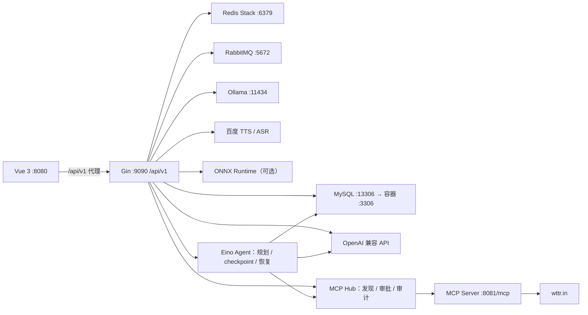

# GopherAI v2 复刻版

这是一个 Go + Vue 3 的全栈 AI 应用服务平台，复刻并扩展了 GopherAI v2 的主要功能：JWT 登录注册、多会话聊天与 SSE 流式输出、动态多模型网关、Knowledge Base 2.0、MCP Hub、持久化 Eino Agent、异步消息持久化、TTS/ASR 和可选的 ONNX 图像识别。

## 功能与模型

- Gin REST API、JWT 鉴权，MySQL/GORM 保存用户、会话和消息。
- RabbitMQ 异步写入聊天消息；Redis 保存验证码，Redis Stack 为 RAG 提供向量索引。
- Vue 3 + Element Plus 前端，包含注册、登录、AI 聊天、Agent 任务、知识库、模型目录、MCP Hub 和图像识别页面。
- 动态模型目录将 provider、上游模型和应用 pipeline 分离；新请求使用 `openai`、`rag`、`mcp`、`ollama`、`ark`，同时兼容旧 `1`–`4`。
- Knowledge Base 2.0 支持多库、多文档、异步持久化索引、失败状态、用户隔离、跨库检索以及精确到文档/标题/字符区间的引用。
- MCP Hub 从受信 registry 动态发现工具，提供服务/工具 allowlist、JSON Schema 参数校验、风险分级、一次性审批、只读重试和脱敏审计。
- Agent 使用 Eino Graph 执行“规划 → 工具 → 总结”状态流；任务、步骤和 checkpoint 写入 MySQL，支持人工审批、取消、失败恢复与进程中断恢复。非幂等调用结果不确定时不会自动重放，必须由用户显式确认；手动恢复会从 MySQL 状态源重建 graph，因此损坏或旧版本 checkpoint 不会永久卡住任务。
- 本地 Ollama 默认使用 `deepseek-r1:1.5b`；Ark/豆包通过火山方舟官方 Responses API 接入，未配置时在目录中显示为不可用。
- 百度智能云长文本 TTS 与短音频 ASR；浏览器聊天页可直接录音并把识别文本填入输入框。凭据为空时语音功能不可用。
- ONNX Runtime + MobileNetV2 图像分类采用可选 `onnx` build tag，默认构建无需本机安装 ONNX Runtime。

## 架构



`docker-compose.yml` 只启动 MySQL、Redis Stack 和 RabbitMQ。后端、前端、MCP 以及所有外部 AI 服务均在宿主机单独运行。基础设施端口均绑定到 `127.0.0.1`；生产部署、迁移、备份和恢复步骤见 [运行手册](docs/operations.md)。

## 环境要求

- Go 1.24.x；根模块声明 `toolchain go1.24.10`。
- MCP 是独立 Go module，声明 Go 1.25.4；允许时 Go toolchain 会自动获取相应工具链。
- Node.js 18 或更高版本及 npm。
- Docker Desktop 或 Docker Engine + Compose v2。
- 可访问所选 OpenAI 兼容服务；MCP 天气查询还需访问 `wttr.in`。
- 使用模型 `4` 时需要本机 Ollama，以及配置中指定的已下载模型。

## 本地启动

### 1. 启动基础设施

```powershell
docker compose up -d
docker compose ps
```

当前这台机器的 Docker Engine 位于 WSL `Ubuntu-24.04`，Windows 侧没有 Docker CLI，可改用：

```powershell
wsl.exe -d Ubuntu-24.04 -- docker compose -f /mnt/c/Users/Haruka/GolandProjects/goAI/docker-compose.yml up -d
wsl.exe -d Ubuntu-24.04 -- docker compose -f /mnt/c/Users/Haruka/GolandProjects/goAI/docker-compose.yml ps
```

无需另外提供 “compose-volume 文件”；Compose 会自动创建 `goai_mysql-data`、`goai_redis-data` 和 `goai_rabbitmq-data` 命名卷。首次启动需要拉取镜像。

本机 WSL Docker 当前还残留一个不可达的 `10.255.255.254:7890` 代理 drop-in。若拉取时报 `proxyconnect ... connection refused`，请在 WSL 终端输入自己的 sudo 密码执行以下可恢复修复；原文件会保留为备份：

```bash
sudo mv /etc/systemd/system/docker.service.d/http-proxy.conf \
  /etc/systemd/system/docker.service.d/http-proxy.conf.disabled-gopherai
sudo systemctl daemon-reload
sudo systemctl restart docker
```

开发账号已经与 `config/config.toml` 对齐：MySQL 与 RabbitMQ 均使用用户 `gopherai`、密码 `gopherai_dev_password`；Redis 使用 `gopherai_redis_dev_password`；RabbitMQ vhost 为 `gopherai`。这些只是公开的本地示例值，不可用于生产环境。RabbitMQ 管理页位于 <http://localhost:15672>。

后端启动只验证数据库版本，不会无条件执行 `AutoMigrate`。推荐的 `scripts/run-backend.ps1` 会在启动 API 前显式执行版本化迁移；也可以手动运行 `go run ./cmd/migrate -command up`。生产环境应在发布阶段执行迁移并设置 `GOPHERAI_DB_MIGRATION_MODE=verify`，使 API 在数据库版本落后时拒绝启动。本机已有原生 MySQL 占用 `3306`，所以 Compose 默认把 GopherAI MySQL 映射到宿主机 `13306`；容器内部仍使用 `3306`。若 `13306` 也被占用，请同时修改 Compose 端口映射和 `config/config.toml`。

### 2. 配置本机秘密与 AI 服务

配置按以下优先级合并，后者覆盖前者：

1. `config/config.toml`：可提交的本机开发默认值。
2. `config/config.local.toml`：可选的本机秘密覆盖；该文件已被 Git 忽略。可从 `config/config.local.example.toml` 复制，只填写需要变化的字段。
3. `GOPHERAI_*` 环境变量：最高优先级，完整清单见 `.env.example`。

如果设置 `GOPHERAI_CONFIG_PATH`，它指向一份完整、独立的主 TOML 配置，并替代上述两个默认 TOML 文件；此时不会自动叠加 `config/config.local.toml`。环境变量覆盖仍然生效。加载或数值解析失败时，日志只报告文件路径或变量名，不打印秘密值。

直接执行 `go run .` 时，Go 程序不会自动读取 `.env`。推荐复制 `.env.example` 为 `.env`，只取消并填写实际需要的条目，再用 `scripts/run-backend.ps1` 启动；脚本只把值加载到当前子进程，不回显秘密，也不写入系统环境。也可以手动把变量导入启动后端的同一个进程环境。例如：

```powershell
$env:GOPHERAI_EMAIL = "your-name@163.com"
$env:GOPHERAI_EMAIL_AUTHCODE = "your-163-authcode"
$env:GOPHERAI_MYSQL_PASSWORD = "your-local-password"
$env:GOPHERAI_BAIDU_TTS_API_KEY = "your-baidu-key"
$env:GOPHERAI_BAIDU_TTS_SECRET_KEY = "your-baidu-secret"
```

不要把真实值发到聊天、写入 `config/config.toml` 或提交到 Git。

模型 `1` 使用标准 OpenAI 兼容环境变量：

Windows PowerShell：

```powershell
$env:OPENAI_API_KEY = "your-api-key"
$env:OPENAI_MODEL_NAME = "your-chat-model-id"
$env:OPENAI_BASE_URL = "https://your-openai-compatible-endpoint/v1"
```

macOS/Linux：

```bash
export OPENAI_API_KEY='your-api-key'
export OPENAI_MODEL_NAME='your-chat-model-id'
export OPENAI_BASE_URL='https://your-openai-compatible-endpoint/v1'
```

统一模型请求超时由 `GOPHERAI_MODEL_TIMEOUT_SECONDS` 控制，默认 90 秒，可设置 1–600 秒。`GET /api/v1/AI/models` 返回当前 provider、pipeline、能力与可用状态，响应不会包含 Base URL 或凭据。

可选 Ark/豆包模型通过 Responses API 调用，需要同时配置 `GOPHERAI_ARK_BASE_URL`、`GOPHERAI_ARK_MODEL`（例如 `doubao-seed-2-0-lite-260428`）和 `GOPHERAI_ARK_API_KEY`。未完整配置时不会影响其他模型，只会在模型目录中标记为不可用。

RAG/MCP 的本机默认值为 Ollama 的 `embeddinggemma:latest`（768 维）和 `deepseek-r1:1.5b`，OpenAI 兼容地址为 `http://127.0.0.1:11434/v1`。本机回环地址不需要真实 API Key；程序会向要求非空 Key 的客户端提供非秘密占位值。若改用外部服务，请通过 `GOPHERAI_RAG_API_KEY` 提供独立密钥；未设置时才回退到 `OPENAI_API_KEY`。外部地址在两者都为空时会拒绝初始化。

RAG 服务地址、embedding/chat 模型和维度可在 `[ragModelConfig]` 或以下环境变量中覆盖：`GOPHERAI_RAG_BASE_URL`、`GOPHERAI_RAG_EMBEDDING_MODEL`、`GOPHERAI_RAG_CHAT_MODEL`、`GOPHERAI_RAG_DIMENSION`。`dimension` 必须严格匹配 embedding 模型输出。

模型 `4` 直接读取同一文件的 `[ollamaConfig]`，不使用 `OPENAI_API_KEY`。当前本机默认配置如下；这里需要 Ollama 的原生 API 根地址，不要追加 `/v1`：

```toml
[ollamaConfig]
baseUrl = "http://127.0.0.1:11434"
modelName = "deepseek-r1:1.5b"
```

启动后端前可用 `ollama list` 确认模型存在，并访问 <http://127.0.0.1:11434/api/version> 确认 Ollama 正在运行。前端选择“本地 Ollama（DeepSeek R1 1.5B）”即可使用；在同一会话切换模型时，已有消息历史会保留并提供给新模型。

邮箱验证码使用 `[emailConfig]`（当前实现固定连接 `smtp.163.com:465`，使用隐式 TLS）；TTS 与 ASR 共用 `[voiceServiceConfig]` 中的百度智能云凭据。不使用相关功能时可保持为空。

### 3. 启动后端

Windows 本机推荐在仓库根目录执行：

```powershell
# 默认启用已准备好的真实 ONNX 图像识别
.\scripts\run-backend.ps1

# 如暂时不需要图像识别
.\scripts\run-backend.ps1 -WithoutOnnx

# 已在独立发布阶段完成迁移时，可只验证后启动 API
.\scripts\run-backend.ps1 -SkipMigrations
```

若 PowerShell 执行策略阻止脚本，可仅对本次进程使用：`powershell.exe -ExecutionPolicy Bypass -File .\scripts\run-backend.ps1`。脚本会自动使用项目内的 MobileNetV2、ONNX Runtime 和便携 GCC；直接运行 `go run .` 仍使用不依赖 CGO 的占位图像服务。

后端监听 <http://127.0.0.1:9090>。MySQL 是启动必需项；注册验证码与 RAG 需要 Redis Stack。RabbitMQ 不可用时，聊天消息会自动同步回退到 MySQL；完整体验仍建议启动 Compose 中的全部服务。

### 4. 启动 MCP（使用模型 3、MCP Hub 或 Agent 工具时必需）

另开终端：

```powershell
.\scripts\run-mcp.ps1
```

默认 registry 为 `config/mcp_servers.json`，只允许本机 `weather` 服务及其只读 `get_weather` 工具。可以通过 `GOPHERAI_MCP_REGISTRY_PATH` 指向另一份 registry；registry 只引用凭据所在的环境变量名，不能直接写入密钥。可在另一个终端验证天气工具：

```powershell
Set-Location common/mcp
go run . --mode client --city Shanghai
```

后端启动时会同时启动 Agent worker，并自动扫描数据库中待执行任务。创建 Agent 任务时请选择模型目录中可用的 `chat` pipeline（例如 `ark`、`openai` 或 `ollama`）；工具只会通过 MCP Hub 执行，不能绕过 allowlist、参数校验、风险分级和审计。高风险步骤会停在前端“Agent 任务”页面等待批准或拒绝。

### 5. 启动前端

Windows PowerShell 建议显式调用 `npm.cmd`，可避开系统对 `npm.ps1` 的执行策略限制：

```powershell
Set-Location vue-frontend
npm.cmd ci
npm.cmd run serve
```

macOS/Linux 将 `npm.cmd` 换成 `npm`。前端监听 <http://localhost:8080>，开发代理会把 `/api/v1/*` 原样转发到后端；可通过 `vue-frontend/.env.example` 中的变量覆盖 API 前缀和代理目标。

生产构建会保留稳定的 `runtime`、`vue-core`、`axios` 与 Element Plus 公共块，并按路由延迟加载认证、聊天、知识库、MCP、Agent 等功能页；页面首次启动不再下载单一的 `chunk-vendors` 大包。

### 终端界面（TUI）

在后端服务启动后，可运行交互式终端界面：

```powershell
go run ./cmd/tui --server http://127.0.0.1:9090
```

它提供健康检查、内存令牌登录、会话浏览、历史查看以及新建/续接聊天。交互式终端会隐藏密码输入，令牌不会写入磁盘；也可通过 `GOPHERAI_TUI_SERVER`、`GOPHERAI_TUI_TOKEN` 设置默认服务和令牌，`--no-clear` 可关闭 ANSI 清屏。共享主机上避免将 token 直接写在命令行，因为其他本机用户可能读取进程参数；管道输入密码时由调用方负责保护 stdin。

项目源码统一使用无 BOM 的 UTF-8，编辑器会通过根目录 `.editorconfig` 与 `.gitattributes` 自动采用该编码。Windows PowerShell 5.1 查看中文文件时应显式执行 `Get-Content -Encoding UTF8 <文件>`，或使用 PowerShell 7；否则无 BOM 文件可能被按系统 ANSI 代码页读取，终端会显示成乱码，但文件内容本身没有损坏。前端 HTML 已声明 UTF-8，Gin JSON 响应默认携带 UTF-8，聊天 SSE 也明确返回 `text/event-stream; charset=utf-8`。

## ONNX 图像识别

当前本机工作区已经准备好以下资源，均在 Git 忽略目录中，不会进入源码提交：

- `models/mobilenetv2/mobilenetv2-7.onnx`：ONNX Model Zoo MobileNetV2 v2-7，SHA-256 为 `c1c513582d56afceff8516c73804e484c81c6a830712ab6d682253f4a3cd042f`。
- `models/mobilenetv2/synset.txt`：ImageNet 1000 类标签。
- `runtime/onnxruntime-win-x64-1.22.0/lib/onnxruntime.dll`：与 `onnxruntime_go v1.22.0` 对齐的 Microsoft ONNX Runtime 1.22.0。
- `tools/w64devkit/`：便携 MinGW-w64 GCC；不修改系统 PATH。

`scripts/run-backend.ps1` 会设置模型、标签、DLL、CGO 和兼容编译器包装器，然后使用 `-tags onnx` 启动。预处理遵循模型说明：短边缩放到 256、中心裁剪 224、ImageNet mean/std 归一化、NCHW float32。模型节点和形状为输入 `data [1,3,224,224]`、输出 `mobilenetv20_output_flatten0_reshape0 [1,1000]`。

Go 1.25.5 目前不能直接解析新版 MinGW 产生的 `pe-bigobj` cgo 探测对象，因此 Windows 上不要只执行裸 `go run -tags onnx .`；请使用启动脚本内置的兼容包装器。真实集成测试已经校验节点、类型、shape、内存图片和系统壁纸推理。其他平台或更换工具链时，仍可通过 `.env.example` 中的三个 `GOPHERAI_ONNX_*` 变量覆盖资源路径。

## API 概览

除公开用户接口外，CLI 和第三方客户端可使用 `Authorization: Bearer <token>`。内置 Vue 前端不再持久化 JWT：它使用 `HttpOnly` 会话 Cookie（生产环境同时启用 `Secure` 与 `SameSite=Strict`），并在所有会改变状态的 Cookie 请求中附带 CSRF header。因此生产部署应让 SPA 与 API 处于同一 HTTPS origin；升级后的浏览器需要重新登录一次。

| 方法 | 路径 | 用途 |
| --- | --- | --- |
| `GET` | `/livez` | 进程存活探针，不访问外部依赖 |
| `GET` | `/readyz` | MySQL、Redis与后台 worker 就绪状态 |
| `GET` | `/healthz` | `/readyz` 的兼容别名 |
| `GET` | `/metrics` | Prometheus 兼容的 HTTP 与健康状态指标 |
| `POST` | `/api/v1/user/captcha` | 发送邮箱验证码 |
| `POST` | `/api/v1/user/register` | 注册 |
| `POST` | `/api/v1/user/login` | 登录并建立 Cookie 会话或取得 JWT |
| `GET` | `/api/v1/user/session` | 查询当前 Cookie/Bearer 会话身份 |
| `POST` | `/api/v1/user/logout` | 清除浏览器会话 Cookie |
| `GET` | `/api/v1/AI/chat/sessions` | 会话列表 |
| `GET` | `/api/v1/AI/models` | 动态模型目录与可用状态 |
| `POST` | `/api/v1/AI/chat/send-new-session` | 新建会话并发送消息 |
| `POST` | `/api/v1/AI/chat/send` | 向已有会话发送消息 |
| `POST` | `/api/v1/AI/chat/history` | 查询会话历史 |
| `POST` | `/api/v1/AI/chat/send-stream-new-session` | 新会话 SSE 响应 |
| `POST` | `/api/v1/AI/chat/send-stream` | 已有会话 SSE 响应 |
| `POST` | `/api/v1/AI/chat/tts` | 创建长文本 TTS 任务 |
| `GET` | `/api/v1/AI/chat/tts/query?task_id=...` | 查询 TTS 任务 |
| `POST` | `/api/v1/AI/chat/asr` | 识别短音频，multipart 字段为 `file` |
| `POST` | `/api/v1/file/upload` | 上传 RAG 文档，multipart 字段为 `file` |
| `POST/GET` | `/api/v1/file/knowledge-bases` | 创建/列出知识库 |
| `GET/DELETE` | `/api/v1/file/knowledge-bases/:id` | 查询/删除知识库 |
| `POST/GET` | `/api/v1/file/knowledge-bases/:id/documents` | 异步上传/列出文档 |
| `GET` | `/api/v1/file/knowledge-bases/:id/documents/:documentId/status` | 文档与索引状态 |
| `DELETE` | `/api/v1/file/knowledge-bases/:id/documents/:documentId` | 删除文档与向量 |
| `POST` | `/api/v1/file/knowledge-bases/:id/search` | 调试单库检索与引用 |
| `GET` | `/api/v1/file/index-tasks/:taskId` | 查询持久化索引任务 |
| `GET` | `/api/v1/mcp-hub/servers` | MCP 服务状态 |
| `POST` | `/api/v1/mcp-hub/servers/reload` | 重载受信 registry |
| `POST` | `/api/v1/mcp-hub/servers/:serverId/refresh` | 刷新单个 MCP 服务的工具目录 |
| `GET` | `/api/v1/mcp-hub/tools` | 动态工具目录；`refresh=true` 时强制刷新上游 |
| `POST` | `/api/v1/mcp-hub/tools/call` | 校验并调用工具 |
| `POST` | `/api/v1/mcp-hub/approvals` | 创建高风险调用审批 challenge |
| `POST` | `/api/v1/mcp-hub/approvals/:approvalId/approve` | 签发一次性审批 token |
| `GET` | `/api/v1/mcp-hub/audits` | 当前用户的脱敏审计记录 |
| `POST/GET` | `/api/v1/agent/tasks` | 创建/列出当前用户的 Agent 任务 |
| `GET` | `/api/v1/agent/tasks/:taskId` | 查询任务、计划和步骤时间线 |
| `POST` | `/api/v1/agent/tasks/:taskId/steps/:stepId/approve` | 批准等待中的工具步骤并继续 |
| `POST` | `/api/v1/agent/tasks/:taskId/steps/:stepId/reject` | 拒绝等待中的工具步骤 |
| `POST` | `/api/v1/agent/tasks/:taskId/resume` | 恢复失败任务；重放未知结果需 `retry_unknown: true` |
| `POST` | `/api/v1/agent/tasks/:taskId/cancel` | 取消任务并阻止旧 worker 回写 |
| `POST` | `/api/v1/image/recognize` | 图像分类，multipart 字段为 `image` |

聊天会话和历史均使用游标分页，避免长期用户一次读取全部记录。`GET /api/v1/AI/chat/sessions` 可选 `limit`（默认 `50`、最大 `100`）和不透明的 `cursor` 查询参数；`POST /api/v1/AI/chat/history` 接受 `{ "sessionId", "limit", "cursor" }`。两者均返回 `hasMore` 与 `nextCursor`；首个历史页是最新一页但其中消息保持时间正序，携带游标后取得更早的一页。旧客户端省略分页参数仍可工作，只会得到默认大小的最新页。每次成功完成聊天都会刷新会话活跃时间；部署本版本前需应用 `202607290003` 迁移，以建立对应的活动会话索引。

`/readyz` 对 MySQL 和 Redis 使用共享的 1 秒超时；任一关键依赖不可用或服务正在退出时返回 HTTP `503`。RabbitMQ、Agent、知识库索引和注册邮件 worker 属于可降级组件，异常时返回 HTTP `200` 和 `status: "degraded"`。探针响应不会暴露底层连接错误或凭据。

所有 HTTP 响应都会回显 `X-Request-ID`（可由客户端提供安全的字母、数字、`-`、`_`、`.` 组合），并产出不含请求体、查询参数、Cookie 或授权头的 JSON 访问日志。`/metrics` 使用 Gin 路由模板而非原始 URL 作为标签，包含请求总数、延迟直方图、进行中请求和就绪检查状态。默认仅允许 loopback 采集；远程 Prometheus 必须配置 `GOPHERAI_METRICS_TOKEN`，并发送 `Authorization: Bearer <token>`。健康状态会短暂缓存，避免高频 scrape 放大对 MySQL 和 Redis 的探测负载。

认证接口使用 Redis 原子限流：验证码同邮箱 60 秒内只能发送一次、每小时最多 5 次，同 IP 每小时最多 20 次；验证码校验同邮箱 5 分钟最多 5 次；登录同 IP 5 分钟最多 30 次、同账号 15 分钟最多 10 次。超限返回 HTTP `429`、业务码 `2011`，并携带 `Retry-After`。

聊天、TTS/ASR、RAG 上传与检索、MCP 调用/审批/刷新、Agent 创建/批准/恢复、图像识别共用昂贵操作保护。默认每个用户每 60 秒总计最多 60 次，并另外应用分类额度：Chat 20、Voice 10、RAG 10、MCP 30、Agent 10、Image 10；单用户最多 2 个、单进程最多 32 个并发请求，串行 ONNX 图像识别另有跨用户的单进程 1 请求专用上限。JSON 请求体最大 1 MiB；RAG multipart 请求最大 21 MiB（20 MiB 文档加 1 MiB envelope）；聊天和 RAG 查询最大 16,000 个 Unicode 字符。Redis 时间窗额度会在读取请求体和占用本机处理槽之前预留，因此慢请求也会计入额度。超额或并发饱和返回 HTTP `429` 与 `Retry-After`；Redis 无法执行分布式额度检查时返回 HTTP `503`。纯 `GET /api/v1/mcp-hub/tools` 不占额度，只有 `refresh=true` 才进入 MCP 保护。所有默认值均可通过 `.env.example` 中的 `GOPHERAI_COST_GUARD_*` 变量覆盖。

图像识别只接受实际内容为 JPEG、PNG 或 GIF 的文件，编码大小最大 10 MiB、解码后最大 2500 万像素、单边最大 10000 像素。ONNX recognizer 在首次请求时创建并复用，共享 tensor 的推理会串行执行，停机时安全释放。

Gin 默认不信任任何代理转发头，防止伪造 `X-Forwarded-For` 绕过 IP 限流。若通过 Nginx、Ingress 等反向代理部署，应在路由初始化处把 `SetTrustedProxies(nil)` 改成实际代理的精确 IP/CIDR，切勿信任任意来源。

注册成功以用户记录写入 MySQL 为准。账号通知邮件状态与用户记录一同持久化；SMTP 暂时失败不会把已创建账号伪装成注册失败，后台会按指数退避重试。注册响应会直接返回 `username`，前端会要求用户确认保存。

新聊天请求推荐发送目录中的 pipeline ID，并可选择知识库；旧 `modelType` 仍保留：

```json
{
  "question": "这个项目的部署要求是什么？",
  "modelId": "rag",
  "modelType": "2",
  "knowledgeBaseIds": ["knowledge-base-uuid"]
}
```

普通响应的 `citations` 给出实际参与 prompt 的来源。SSE 使用 `data: {"content":"..."}` 发送文本分片，在结束前可发送 `data: {"citations":[...]}`，最后发送 `data: [DONE]`；前端也兼容旧的纯文本 SSE 分片。

聊天会话列表和完整历史以 MySQL 为准。进程启动时不会再重建所有用户的模型上下文；仅在某个会话首次继续对话时读取最近 64 条持久化消息，并将活跃模型上下文限制为相同窗口，以控制启动时间、内存占用和单次模型 prompt 的规模。空闲 30 分钟的模型上下文会在后续访问时惰性回收；正在生成响应的上下文不会被回收，重新打开后会从持久化消息尾部恢复。

## 停止与清理

后端收到 `SIGINT` 或 `SIGTERM` 后会立即将 readiness 切换为不可用，最多等待 10 秒排空 HTTP 请求，再等待 Agent、索引、邮件和 RabbitMQ worker 退出，释放共享 ONNX recognizer，最后依次关闭 MCP、Redis 与 MySQL。整个后台资源清理阶段最多等待 15 秒。

```powershell
docker compose down
```

数据库数据保存在命名卷中。只有确定不再需要本地数据时才执行 `docker compose down -v`。

## 安全与生产说明

- `config/config.toml` 和 Compose 中的账号仅供本机开发；上线前更换数据库、RabbitMQ、JWT、邮箱和 TTS 凭据。
- 使用 `docker-compose.production.yml` 时必须提供非开发的 MySQL、Redis 和 RabbitMQ 秘密；数据平面端口保持回环绑定，RabbitMQ 管理端口不发布。发布前执行 `go run ./cmd/migrate -command up`，运行时使用 `GOPHERAI_DB_MIGRATION_MODE=verify`。
- 本项目支持被 Git 忽略的本地覆盖文件和环境变量；`scripts/run-backend.ps1` 可加载本机 `.env`，但项目未内置密钥保险库。生产环境应使用平台的 secret 管理，并检查日志中是否包含 token、连接串或上游响应。
- 上传文件会写到本地 `uploads/`；使用 `scripts/backup.ps1`、`scripts/restore.ps1` 与 [运行手册](docs/operations.md) 定期完成隔离恢复演练，并在生产部署中增加容量、隔离与恶意文件防护策略。
- MCP 工具、OpenAI 兼容聊天、embedding、TTS 与 ASR 均会把相应请求发送到对应服务，请确认数据合规要求。默认 Ollama 地址仅在本机；若改为远程地址，也应按外部服务处理数据合规。

## 原项目与许可证

本仓库基于 [youngyangyang04/GopherAI](https://github.com/youngyangyang04/GopherAI) 的 v2 源码进行复刻与工程化整理，并非原作者发布的官方版本。根目录保留原仓库提供的 GNU General Public License Version 3 文本。

复制、修改或分发本项目时，请同时保留版权与许可证告知，并遵守 GPLv3 对相应源码提供和派生作品许可的要求。完整条款见 [LICENSE](LICENSE)。
